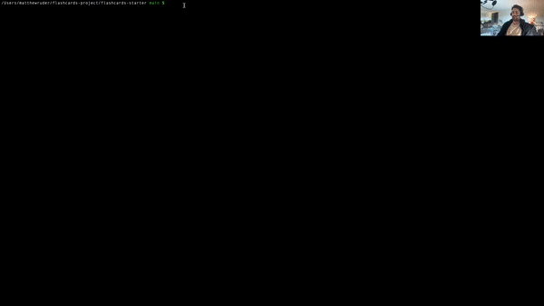

# Flashcards

This is a Command Line Interface game wherein the user will
be led through a series of multiple-choice questions and given a
"percentage correct" at the end.

## Working Application

 / ! 

## Technologies Used

This application was made entirely with Javascript

## Install Instructions

Clone down the forked repo from GitHub.

Once you have cloned the repo, change into the directory and install the library dependencies by running "npm install".

To play the game, run "node index.js" from your terminal.
